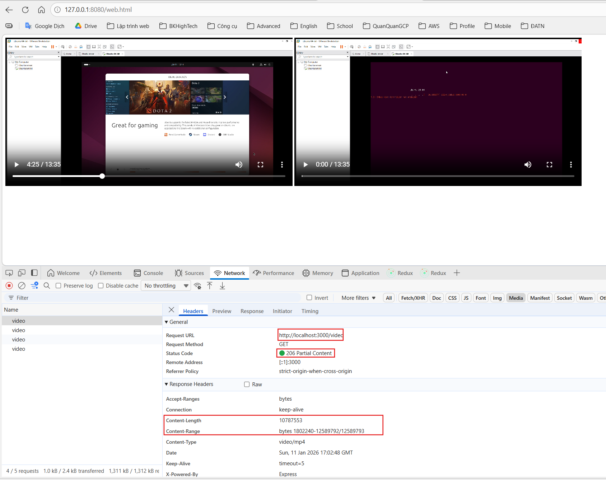
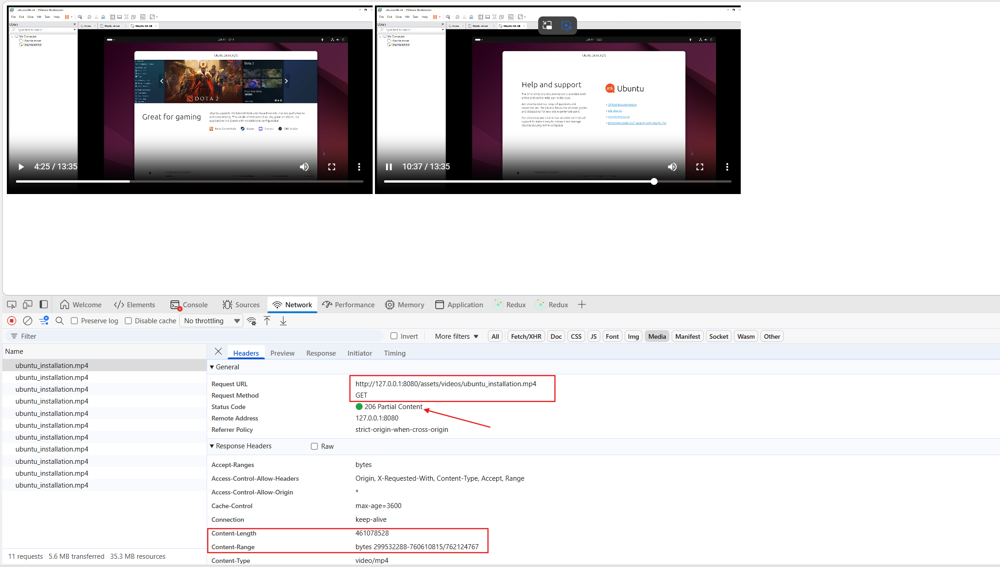
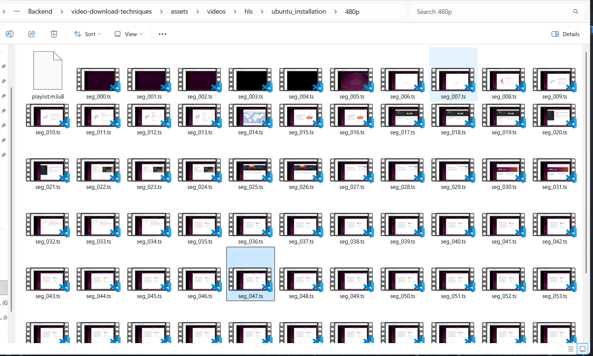
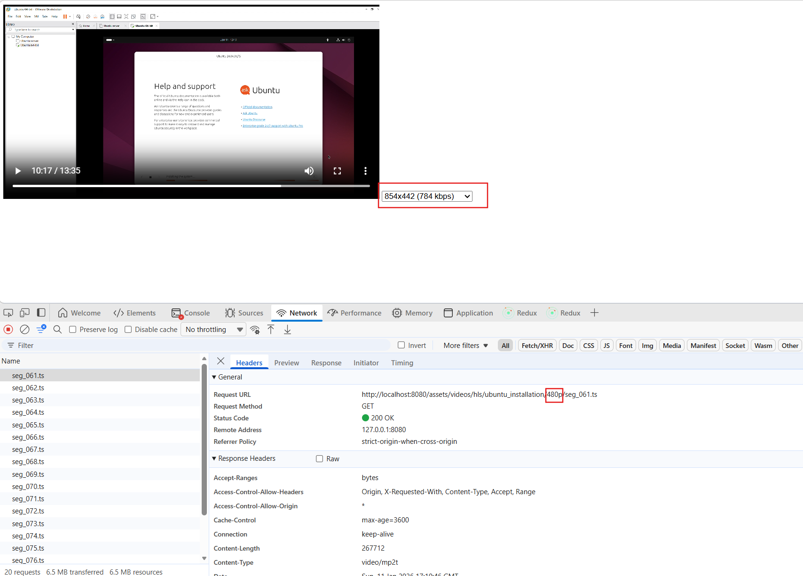
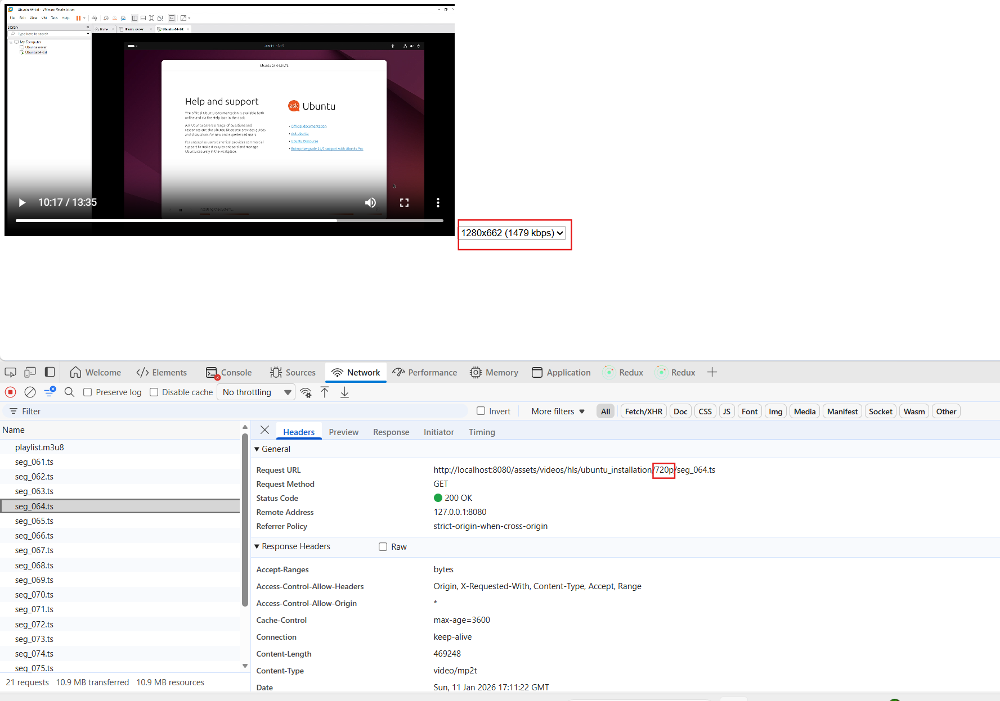
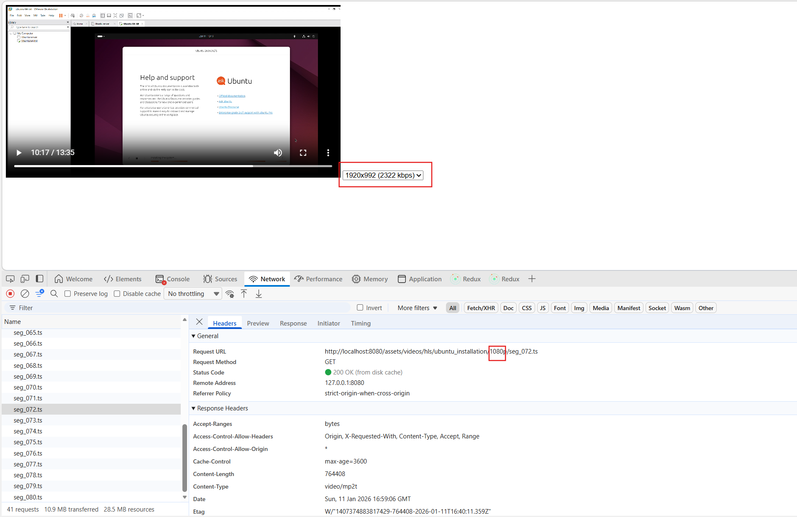

# Video Download Techniques

## 1. Progressive Download

✅ **Progressive Download** is not a different protocol but rather how browsers progressively download and play video using **HTTP Range Requests**.

### How it works:
- When the browser encounters a `<video>` tag, it will:
  - Send requests with `Range` header to get a byte segment of the file
  - Server returns HTTP 206 Partial Content with that data portion
  - Browser buffers and plays immediately while continuing to download

👉 **Progressive Download**: fetch by range to play immediately without waiting for the entire file to download.

### Technical Features:
- Browser sends HTTP Range Requests to download video in parts
- Any server returns HTTP 206 Partial Content for requested segments
- `<video>` tag progressively loads and plays, allowing seeking to the middle of the video

### Advantages:
👀 Progressive Download is not a new protocol, just HTTP + range requests for video serving.
→ No need for custom server if current server supports HTTP Range (Nginx, http-server, Express static, MinIO, S3, CDN all support it).

📌 Whether local file or HTTP, browser still sends range requests and handles progressive download automatically.

### Implementation Examples:

**Custom server to return video file by range request:**


**Video tag + local file still supports range request:**


*Progressive Download doesn't require a "custom server" - it's simply using HTTP Range to download video in parts. The server can be any HTTP server that supports Range (static server, S3, MinIO, CDN, Express, Nginx,...)*

## 2. HLS (HTTP Live Streaming) Download

HLS is a popular video streaming protocol that divides video into small .ts segments and uses .m3u8 playlist files for management.

### 🎯 Key Concept: HLS Doesn't Wait for Full Video Download

✅ **HLS doesn't require downloading the entire video before playing** — it downloads in chunks (segments) and the player can start playing immediately when enough data from the first chunks is available. This is the core principle of HLS streaming over HTTP.

#### Why HLS Streams Quickly and Doesn't Wait for Full Video

📌 **HLS divides video into small segments** (e.g., each ~5-10 seconds). These segments are listed in the .m3u8 playlist. When the player starts:

- Player downloads the playlist (.m3u8) first → knows the list of segments to load
- Player only downloads the first few segments for buffering, then plays immediately → no need to download the entire large video file first
- While playing, player downloads the next segment in sequence → each segment is loaded separately via HTTP GET → streams in small chunks

#### Difference from Progressive Download

🔹 **Progressive download** loads byte ranges within the same MP4 file using Range requests. → Browser can start playing when the first portion has enough buffer.

🔹 **HLS** loads small segment files, doesn't wait for the entire video to be on the client, because the player only needs the first few segments. → HLS has a more structured approach for adaptive bitrate, live streaming, seeking, and fast-forwarding.

📌 This is why you see:

✔ HLS video starts playing almost immediately
✔ In DevTools you see each segment loaded separately (.ts files)
✔ Player doesn't download the entire video before playing — it streams in chunks like true streaming

⏱ This helps:

- Reduce video startup time
- Only load necessary data
- Enable adaptive bitrate (load appropriate quality)
- Work efficiently with live streaming or video on demand

🧠 **Summary**

📌 HLS supports playback immediately when only the first few segments are loaded
📌 Doesn't "wait for the entire video to download"
📌 Player continuously downloads the next segment while playing
📌 This is the characteristic of adaptive, chunk-based streaming ≠ traditional progressive download

### Create Simple HLS Files:

```bash
ffmpeg -i ubuntu_installation.mp4 -c:v libx264 -c:a aac -b:a 128k -f hls -hls_time 10 -hls_list_size 0 hls/ubuntu_installation/master.m3u8
```

This command will create:
- 1 playlist `master.m3u8`
- Segment `.ts` files in the `hls/ubuntu_installation` directory

### Create HLS with Multiple Qualities (Adaptive Bitrate):

```bash
ffmpeg -i ubuntu_installation.mp4 \
  -vf "scale=1920:-2" -c:v libx264 -b:v 5000k -c:a aac -b:a 192k \
  -hls_time 10 -hls_playlist_type vod \
  -hls_segment_filename "hls/ubuntu_installation/1080p_%03d.ts" \
  hls/ubuntu_installation/1080p.m3u8 \
  -vf "scale=1280:-2" -c:v libx264 -b:v 2500k -c:a aac -b:a 128k \
  -hls_time 10 -hls_playlist_type vod \
  -hls_segment_filename "hls/ubuntu_installation/720p_%03d.ts" \
  hls/ubuntu_installation/720p.m3u8 \
  -vf "scale=854:-2" -c:v libx264 -b:v 1200k -c:a aac -b:a 96k \
  -hls_time 10 -hls_playlist_type vod \
  -hls_segment_filename "hls/ubuntu_installation/480p_%03d.ts" \
  hls/ubuntu_installation/480p.m3u8
```



### Run HLS Server:

```bash
http-server ./hls/ubuntu_installation -p 8080 --cors
```

### Frontend Usage:

In the frontend, simply call the `master.m3u8` file. The browser will:
- Read the master playlist content
- Select appropriate quality based on internet connection
- Automatically download and play segments








## 3. HLS vs Progressive Download Comparison

### 🔹 1) Fast Loading & Playback

✅ **Both HLS and Progressive Download allow fast startup** without waiting for the entire video to download.

- **Progressive Download**: Loads byte ranges within a single file → starts when buffer is sufficient
- **HLS**: Loads small segments → starts when first few segments are ready

➡ **But HLS usually starts faster and is more optimized**, because the player only needs to load a few short segments instead of ranges within a large file.

### 🔹 2) Adaptive Bitrate (Quality Adaptation)

📍 **This is HLS's biggest advantage**:

🔸 **HLS supports Adaptive Bitrate Streaming (ABR)**
- HLS has a master playlist listing different qualities
- Player automatically switches to appropriate quality based on bandwidth (reduces stuttering/buffering when network is weak)

🔸 **Progressive Download doesn't support Adaptive**
- Only has 1 quality in 1 MP4 file

📌 **Conclusion**: If network is unstable or you want to optimize UX for multiple devices, **HLS is better than Progressive**.

### 🔹 3) Bandwidth Optimization & CDN

🔹 **HLS only loads segments that users actually watch**
→ If user only watches 1/3 of video, only the first few segments are loaded — saves bandwidth.

🔹 **Progressive Download** gradually loads the entire file even if user doesn't watch it all → potential bandwidth waste.

🔹 **HLS small segments help CDN cache efficiently**, serving multiple users simultaneously better.

### 🔹 4) Scalability & Distribution

⭐ **HLS is widely used in real streaming systems, especially with CDN** — because:

- Player can load segments from different edge servers
- Easy to distribute to millions of users globally

While Progressive Download is a simpler technique, good for small content or single-viewer environments.

### 🔹 5) Live Streaming Support

❌ **Progressive Download is not suitable for live streaming**
✔ **HLS supports live streaming** by continuously providing new playlists and segments while video is playing.

👉 If you want to stream live events (live events, cameras...), **HLS is the clear choice**.

### 🔹 6) Setup Complexity

✔ **Progressive Download is very simple**: just HTTP server and standard MP4 file
❗ **HLS requires additional steps**: create segments + playlist, then set up server to serve segment directory

👉 **HLS is slightly more complex, but the superior benefits** — adaptive, CDN, live — make it the current standard method.

### 📊 Comparison Table

| Feature | Progressive Download | HLS (HTTP Live Streaming) |
|---------|---------------------|---------------------------|
| **File Structure** | Single MP4 file | Multiple small .ts segments + .m3u8 playlist |
| **Adaptive Bitrate** | ❌ Not supported | ✅ **Supported** - Multiple qualities, auto-switch |
| **Live Streaming** | ❌ Not supported | ✅ **Supported** - Perfect for live events |
| **CDN Compatibility** | ⚠️ Basic | ✅ **Excellent** - Segment-based caching |
| **Startup Speed** | ✅ Fast | ✅ **Faster** - Only needs first few segments |
| **Scalability** | ⚠️ Good for small audiences | ✅ **Excellent** - Handles millions of users |
| **Seek/Scrubbing** | ✅ Supported | ✅ **Supported** - Better with segments |
| **Setup Complexity** | ✅ **Simple** - Just HTTP server | ⚠️ More complex - Requires segmentation |
| **Network Recovery** | ⚠️ Fixed quality, may buffer on bad network | ✅ **Better** - Can adapt quality |
| **Storage Requirements** | ✅ Single file | ⚠️ Multiple files (segments + playlist) |

### 📌 When to Use HLS?

#### 🟢 **Choose HLS when you need**:

- ✅ **Unstable user networks** - Adaptive bitrate prevents buffering
- ✅ **Large-scale distribution** - Serving many users across countries
- ✅ **Quality adaptation** - Automatic quality switching based on bandwidth
- ✅ **Live streaming support** - Perfect for live events and real-time content
- ✅ **CDN optimization** - Efficient bandwidth usage and global distribution

#### ❗ **Choose Progressive Download when**:

- ✅ **Simple projects** - Small video files, straightforward implementation
- ✅ **Single quality** - No need for adaptive bitrate features
- ✅ **Limited audience** - Not requiring CDN distribution
- ✅ **Basic functionality** - Just need video to play reliably

## Demo Files

- `progressive-download.html` - Examples of progressive download (server-based and local file)
- `hls-basic.html` - Basic HLS player with automatic quality selection
- `hls-quality-selector.html` - HLS player with manual quality selection control
